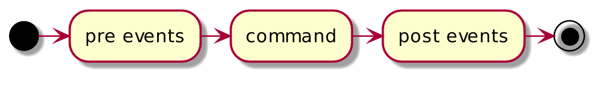
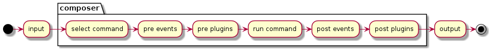

---

layout: yandex2

style: |
    .pre-small pre code { font-size: 24px!important; line-height: 48px!important; }
    .pre-big pre code { font-size: 54px !important; line-height: 108px !important; } #  9 lines x 52 symbols
    .big-list { font-size: 80px!important; line-height: 160px!important; }
    .images-w { background-color: #fff !important; }
    .slide-red { border-left: 9px solid #f00 !important; }
    figure.short { width: 480px !important; }
    .text-center { text-align: center !important; }
    img.center { margin: auto !important; }

---

# {:.logo}

## {{ site.presentation.title }}
{:.title}



{{ site.author.name }}, {{ site.author.position }}



## Введение в Composer
{:.section}

## Чего не будет в докладе

**Лучшие практики Composer (почти не будет ...)**

**Сравнения с аналогами (почти не будет ...)**

**Большие цитаты из документации (почти не будет ...)**

## Что будет в докладе

**Не только про composer**

**Сравнения с аналогами на концептуальном уровне**

**Передаваться приветы разным штукам**

**Одна максимально полезная тематическая ссылка**

## Введение в Composer

**Composer - это ...**

- {:.next}Менеджер пакетов для PHP
- {:.next}Менеджер зависимостей для PHP
- {:.next}Незаменимым инструмент для PHP
- {:.next}...

**Composer это (исправлено) ...**

- {:.next}Управление пакетами для PHP
- {:.next}Управление зависимостями для PHP
- {:.next}PEAR здорового человека (привет, PSR-0/4)
- {:.next}Система автоматической сборки для PHP

## Пакеты или зависимости

- {:.next}Пакет - это добавка к вашему проекту, с помощью которой он (проект) может сделать больше.
- {:.next}Зависимость - это часть вашего проекта, без которой он (проект) не сможет сделать то, что должен.

## Как работает
{:.section}

## Схема работы

## Схема работы: Компоненты

**Компоненты**

* {:.next}Автолоадер
* {:.next}Логгер
* {:.next}Окружение запуска команд
* {:.next}Плагины

## Схема работы с плагинами

## Популярные плагины

* hirak/prestissimo
* brainmaestro/composer-git-hooks
* mouf/nodejs-installer
* neronmoon/scriptsdev

## Проблемы

1. Настройка окружения для запуска команд в композере
1. Настройка вывода результатов выполнения команды
1. Нет возможности запускать фоновые процессы
1. Нельзя повторно запускать комплексную команду со стадии, когда была ошибка

## Как решать проблемы

* Настройка окружения для запуска команд в композере
* Настройка вывода результатов выполнения команды
* Нет возможности запускать фоновые процессы
* Нельзя повторно запускать комплексную команду со стадии, когда была ошибка

## Полезная ссылка

* https://github.com/jakoch/awesome-composer

## Контакты
{:.contacts}



<figure markdown="1">

### {{ site.author.name }}


{{ site.author.position }}



{{ site.author.company.name }}


</figure>



</figure>



<!-- разделитель контактов -->
-------

<!-- left -->
- {:.telegram}hanovruslan
- {:.mail}hanov.ruslan@gmail.com
- {:.github}hanovruslan
- {:.twitter}hanovruslan
- {:.facebook}hanov.ruslan

<!-- right -->

- {:.telegram}symcode
- {:.telegram}symcode_live

<!-- right -->
