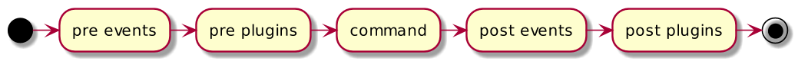

# {:.logo}

## {{ site.presentation.title }}
{:.title}

## План

**Что будет в докладе**{:.next}

**Чего не будет в докладе**{:.red.next}

**План**{:.next}

## План

- {:.next}Введение
- {:.next}Как работает
- {:.next}Проблемы
- {:.next}Решения
- {:.next}Composer 2.0
- {:.next}Выводы

## Введение в Composer
{:.section.section-white}

## Альтернативы

**PHing**{:.next}

**Makefile**{:.next}

**Gradle**{:.next}

## Альтернативы, есть но ...

**Нативность**{:.next}

**Богатый набор фич**{:.next}

**Качество**{:.next}

**Популярность**{:.next}

## Введение

**Composer - это ...**

- Менеджер пакетов для PHP
- Менеджер зависимостей для PHP

**Composer это ...**

- Управление пакетами для PHP
- Управление зависимостями для PHP
- Система автоматической сборки для PHP

## Пакеты или зависимости

- {:.next}Пакет - это добавка к вашему проекту, с помощью которой можно сделать больше.
- {:.next}Зависимость - это часть вашего проекта, без которой нельзя сделать нужное.

## Как работает Composer
{:.section.section-white}

## Схема работы: Компоненты

**Компоненты**

* {:.next}Консольное приложение
* {:.next}Автолоадер
* {:.next}Логгер
* {:.next}Окружение запуска команд

## Схема работы

{:.images-wide}

## Плагины

## Схема работы с плагинами

{:.images-wide}

## Популярные плагины

* hirak/prestissimo
* brainmaestro/composer-git-hooks
* mouf/nodejs-installer
* neronmoon/scriptsdev

## Примеры использование плагинов

**composer require brainmaestro/composer-git-hooks**

```json
    "extra": {      
        "hooks": {
            "pre-commit": "#my mighty bash one-liner"
        },     
    }       
```

**cat .git/hooks/pre-commit**
```bash
#!/bin/sh

#my mighty bash one-liner
```

## Проблемы
{:.section.section-white}

## Проблемы

1. Раздутый набор скриптов
1. Редактирование composer.json из консоли (Composer 2.0)
1. Настройка вывода результатов выполнения команды
1. Работа с переменными окружения
1. Фоновые процессы
1. Повторый запуск команды после последнего успешного шага
1. Оффлайн-режим (Composer 2.0)

### Без учета откровенных багов

## Проблемы: пример с фоновым процессом

## Решения
{:.section.section-white}

## Раздутый набор скриптов: решение
{:.fullscreen}
```php
use Composer\Plugin\Capability\CommandProvider;

class ScriptsCommandProvider implements CommandProvider
{
    /**
     * {@inheritdoc}
     */
    public function getCommands()
    {
        $commands = [];
        /**
         * fullfill commands
         */

        return $commands;
    }
```

## Редактирование composer.json из консоли: решение

**Своя схема для composer.json**

## Composer 2.0

1. Плагин `hirak/prestissimo` больше не нужен
1. `--dry-run` для всех команд управления пакетами
1. `check-platform-reqs` встроена в `dump-autoload`
1. Опция `--no-suggest` удалена?!
1. Полноценная работа с extra из консоли
1. Работа с репозиториями
1. Оффлайн-режим

## Выводы

1. Используйте скрипты
1. Используйте плагины
1. Форк composer-а? Может быть?!

## Полезная ссылка

* https://github.com/jakoch/awesome-composer

## Контакты
{:.contacts}

<figure markdown="1">

### {{ site.author.name }}
{{ site.author.company.name }}

</figure>
<!-- разделитель контактов -->
-------

<!-- left -->
- {:.telegram}hanovruslan
- {:.mail}hanov.ruslan@gmail.com
- {:.github}hanovruslan41

<!-- right -->

- {:.telegram}symcode
- {:.telegram}symcode_live

<!-- right -->
